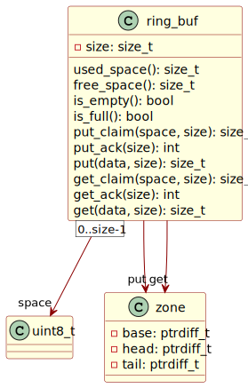

# Ring Buffers

What are ring buffers[^1] and why are they useful? The “ring” in “ring
buffer” refers to fixed-size memory space under continuous cyclic reuse.
The structure is a FIFO[^2] container, ideal for stream buffering where
produced events are processed in the order received by a consumer.
Exemplar applications include asynchronous communication scenarios,
e.g. interrupt service routines in embedded systems.

Zephyr includes a promising
[component](https://docs.zephyrproject.org/latest/kernel/data_structures/ring_buffers.html)
by Intel. Zephyr is an excellent real-time operating system for
resource-constrained embedded devices. Nordic Semiconductor’s [nRF
Connect](https://www.nordicsemi.com/Products/Development-tools/nRF-Connect-for-Desktop)
development kit runs on
[Zephyr](https://github.com/zephyrproject-rtos/zephyr). This article
describes a refactored version of the Zephyr ring buffer implementation.

The goal here is to provide:

- operating system agnostic C99 portability;

- highly efficient constant time complexity;

- an adjusted two-layer ring buffer implementation that allows for
  passive iteration; and

- easy destructive circularity where a write operation consumes the
  oldest read when the buffer fills up.

The implementation language is C99 since the target platform for this
kind of collection structure is a memory-limited embedded device of some
sort. The C99 code needs access to basic types: fast unsigned and signed
integers.



Find the complete implementation on
[GitHub](https://github.com/royratcliffe/ring_buf).

## Claiming and Acknowledging

1.  Claim space,

2.  access space,

3.  acknowledge space.

This is the three-phase basic ring buffer access pattern. Space claims
work on spans of *contiguous* space. Take special note of the important
italics. Buffer claims access only contiguous buffer space, never to
discontiguous space.

<!-- The ring buffer cannot claim more than the buffer currently contains. -->

*Putting* writes to a ring buffer. *Get* operations read from a ring
buffer. One put operation starts with a claim. A successful claim
expands the “put zone” by the requested number of bytes. Acknowledging
the same number of bytes advances the put zone. Notice that the claim
cannot span across the end of the buffer space. Buffer size less the put
zone’s head *clamps* the claim size. It **cannot** exceed the remaining
contiguous space.

``` c
/*!
 * \brief Claims space for putting data into a ring buffer.
 * \details Claims contiguous space. Advances the "put" head.
 */
ring_buf_size_t ring_buf_put_claim(struct ring_buf *buf, void **space,
                                   ring_buf_size_t size) {
  ring_buf_ptrdiff_t base = buf->put.base;
  ring_buf_size_t head = ring_buf_zone_head(&buf->put);
  if (head >= buf->size) {
    base += buf->size;
    head -= buf->size;
  }
  ring_buf_clamp(&size, buf->size - head);
  ring_buf_clamp(&size, ring_buf_free_space(buf));
  if (space)
    *space = (uint8_t *)buf->space + (buf->put.head - base);
  buf->put.head += size;
  return size;
}
```

Acknowledgement works thus:

``` c
/*!
 * \brief Acknowledges space claimed for putting data into a ring buffer.
 * \param buf Ring buffer address.
 * \param size Number of bytes to acknowledge.
 * \retval 0 on successful put.
 * \retval -EINVAL if \c size exceeds previously claimed aggregate space.
 */
int ring_buf_put_ack(struct ring_buf *buf, ring_buf_size_t size) {
  ring_buf_size_t claim = ring_buf_zone_claim(&buf->put);
  if (size > claim)
    return -EINVAL;
  buf->put.head = (buf->put.tail += size);
  if (ring_buf_zone_tail(&buf->put) >= buf->size)
    buf->put.base += buf->size;
  return 0;
}
```

Get operations do their work analogously. Getting spans the get zone,
the used buffer space rather than the free buffer space.

## Putting and Getting

The put operation puts as much data in the ring buffer as possible. Its
answer is the number of bytes successfully buffered. The result may be
zero bytes or less than the number requested. Implementation below.

``` c
/*!
 * \brief Puts non-contiguous bytes into the ring buffer.
 * \details The return value may be less than the given size if the buffer runs
 * out of free space.
 * \note Does \e not automatically acknowledge the space.
 * \param buf Ring buffer.
 * \param data Address of bytes to put.
 * \param size Number of bytes to put.
 * \returns Buffer space to acknowledge in bytes.
 */
ring_buf_size_t ring_buf_put(struct ring_buf *buf, const void *data,
                             ring_buf_size_t size) {
  ring_buf_size_t ack = 0U, claim;
  do {
    void *space;
    claim = ring_buf_put_claim(buf, &space, size);
    (void)memcpy(space, data, claim);
    *(const uint8_t **)&data += claim;
    ack += claim;
  } while (claim && (size -= claim));
  return ack;
}
```

What does this mean in practice? You can put partials. This behaviour
exists by design. It is not a mistake. Use a guarded claim to ensure
full item buffering. Claim first and then *only* acknowledge the put
size if the buffer can successfully claim sufficient space.

Putting *part* of something may not always be required. The buffer may
contain discrete chunks of fixed-size data: integers or floats, for
instance. In such cases, the ring buffer must claim and acknowledge all
or none and never less than all.

Two alternative solutions exist: (i) check the free space first; or (ii)
attempt to put and only acknowledge a complete copy. The first solution
runs faster at first blush. The second solution requires a little more
work but fails quickly assuming the buffer holds *only* chunks of data
of equal size *and* the capacity of the buffer corresponds to a multiple
of that size.

### Putting all, getting all

Acknowledgement only fails if the size of the acknowledgement exceeds
the size of the previous claim. The “putter” can safely ignore the
possible erroneous result if the acknowledgement matches the previous
claim, or when acknowledging zero since zero is always less than or
equal to any previous claim.

``` c
int ring_buf_put_all(struct ring_buf *buf, const void *data,
                     ring_buf_size_t size) {
  ring_buf_size_t ack = ring_buf_put(buf, data, size);
  int err = ack < size ? -EMSGSIZE : 0;
  if (err < 0)
    ack = 0U;
  (void)ring_buf_put_ack(buf, ack);
  return err;
}
```

This approach comes with a disadvantage whenever the claim fails to meet
the requested item size. A partial buffer copy could arise. The partial
put or get operation would correctly disclaim the copied data. A
performance hit occurs nevertheless: copying unnecessarily when the
buffer cannot hold the data when putting the incoming bytes, or has
insufficient data if outgoing. This *only* assumes that the buffer items
have variable lengths or that the buffer space is *not* a multiple of
the item size. Partial copies can never occur for fixed-size items in a
harmonically-sized[^3] buffer space.

## Usage

How does passive iteration work? Take an example. Assume that a ring
buffer contains only floating-point numbers. Repeated claims will
iterate through the *get* zone; a final $0$-acknowledgement will restore
the zone, amounting to a sneaky peek at the buffer’s entire contents.
See the excerpt below; it sums up the floats.

``` c
  float sum = 0.0F;
  void *space;
  while ((ring_buf_get_claim(&buf, &space, sizeof(float))))
    sum += *(float *)space;
  ring_buf_get_ack(&buf, 0U);
```

This makes some assumptions:

1.  It assumes that the buffer only contains floats. Hence the claims
    return only the size of a float or $0$. A non-zero return value
    therefore indicates a float. The `while` condition uses double
    brackets to highlight the implied `!= 0` test.

2.  No memory alignment concerns arise.

Also, note that the iteration does **not** copy the floats. It accesses
the contents without copying them. Zero-copy translates to greater
efficiency for embedded devices, especially useful during interrupt
service handlers and similar time-constrained contexts.

## Conclusions

The implementation makes use of signed integer magic. It aims to
minimise pointer arithmetic. Head and tail indices apply *base*-relative
addressing. A buffer space’s actual head index $h'=h-b$ where $h$ is the
head of a zone and $b$ is its base. The same goes for a zone’s tail.

Some surprises arise. Partial putting seems wrong at first. Some
scenarios exist where this feature presents a desirable asset. Draining
UART or other peripheral buffers come to mind. The UART service handlers
want to put as much data in the ring buffer as possible and acknowledge
the partial transfer so that their downstream handlers can pick up the
contents as quickly as possible while unloading the peripheral registers
as much as possible for the upstream incoming hardware to remain as
ready as possible for the next cycle and its tranche of data.

The implementation differs from Zephyr, albeit inspired by Intel’s
contribution. The simple putter or getter must **always** acknowledge
the claimed space. Put and get operations follow the claim-acknowledge
protocol whether non-contiguous or contiguous. The same protocol applies
to both.

Item-based putting and getting lives in its own separate module—another
difference. The included [item access
interface](https://github.com/royratcliffe/ring_buf/blob/main/ring_buf_item.h)
stores only the size. It does *not* include other information such as
type.

[^1]: also known as circular buffers

[^2]: first in, first out

[^3]: meaning that the entire buffer space divides evenly by the item
    size without remainder
